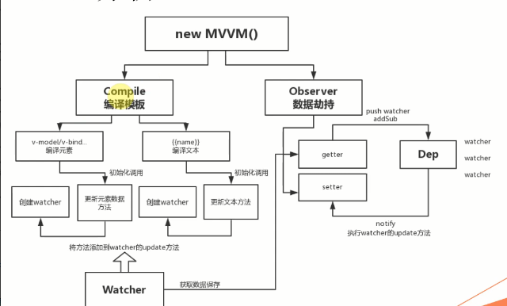

# 请简述 mvvm？

mvvm 是视图和逻辑的一个分离，是 model view view-model 的缩写，通过虚拟 dom 的方式实现双向数据绑定

那么问题来了，你知道 mvvm 是怎么实现的么？

mvvm 是通过 Object 的 defineProperty 属性，重写 data 的 set 和 get 函数来实现的



可以看到 Vue 的编译可以分两个大体的部分

- 一部分是模板的编译 Compile => 有模板指令的标签才执行编译
  ```
  <div>我很帅</div> 不执行编译
  ```
- 一部分是数据劫持 Observer

# 实现 Complie 编译模板的过程

index.html

```
<div id="app">
    <input type="text" v-model="jsonText.text">
    <div>{{message}}</div>
    {{jsonText.text}}
</div>
<script src="./compile.js"></script>
<script src="./vue.js"></script>
<script>
    let vm = new Vue({
        el: '#app',
        data: {
            message: 'gershonv',
            jsonText:{
                text: 'hello Vue'
            }
        }
    })
</script>
```

# vue 类的添加

新建一个 vue.js 文件，其代码如下 构造函数中定义$el 和$data，因为后面的编译要使用到

```
class Vue {
    constructor(options) {
        this.$el = options.el; // 挂载
        this.$data = options.data;

        // 如果有要编译的模板就开始编译
        if (this.$el) {
            // 用数据和元素进行编译
            new Compile(this.$el, this)
        }
    }
}
```

编译需要 el 和相关数据，上面代码执行后会有编译，所以我们新建一个执行编译的类的文件

# compile.js 类的添加

代码步骤：

- 先把真实的 dom 移入到内存中 （因为在内存中操作 dom 速度比较快）

怎么放在内存中？可以利用文档碎片 fragment

- 编译

提取想要的元素节点和文本节点 v-model {{}}

- 把编译好的 fragment 塞回页面里去

```
class Compile {
    constructor(el, vm) {
        this.el = this.isElementNode(el) ? el : document.querySelector(el);
        this.vm = vm;
        if (this.el) {// 如果这个元素能获取到 我们才开始编译
            // 1.先把这些真实的DOM移入到内存中 fragment[文档碎片]
            let fragment = this.node2fragment(this.el)
            // 2.编译 => 提取想要的元素节点 v-model 和文本节点 {{}}
            this.compile(fragment)
            // 3.编译好的fragment在塞回页面里去
            this.el.appendChild(fragment)
        }
    }

    /* 专门写一些辅助的方法 */
    isElementNode(node) { // 判断是否为元素及节点，用于递归遍历节点条件
        return node.nodeType === 1;
    }

    /* 核心方法 */
    node2fragment(el) { // 将el的内容全部放入内存中
        // 文档碎片
        let fragment = document.createDocumentFragment();
        let firstChild;

        while (firstChild = el.firstChild) { // 移动DOM到文档碎片中
            fragment.appendChild(firstChild)
        }
        return fragment;
    }

    compile() {
    }
}
```

编译的过程就是把我们的数据渲染好，表现在视图中

# 编译过程

- 提取想要的元素节点和文本节点 v-model {{}}
- 首先需要遍历节点，用到了递归方法，因为有节点嵌套

对节点进行遍历 判断是否为文本节点还是元素节点，进行不同的编译方法

其中提取了编译的方法 CompileUtil

```
class Compile{
    // ...
    compile(fragment) {
        // 遍历节点 可能节点套着又一层节点 所以需要递归
        let childNodes = fragment.childNodes
        Array.from(childNodes).forEach(node => {
            if (this.isElementNode(node)) {
                // 是元素节点 继续递归
                // 这里需要编译元素
                this.compileElement(node);
                this.compile(node)
            } else {
                // 文本节点
                // 这里需要编译文本
                this.compileText(node)
            }
        })
    }
}

CompileUtil = {
    text() { // 文本处理

    },
    model() { // 输入框处理

    },
    updater: {
        // 文本更新
        textUpdater(node, value) {
            node.textContent = value
        },
        // 输入框更新
        modelUpdater(node, value) {
            node.value = value;
        }
    }
}
```

到现在为止 就完成了数据的绑定，也就是说 new Vue 实例中的 data 已经可以正确显示在页面中了，现在要解决的就是如何实现双向绑定

结合开篇的 vue 编译过程的图可以知道我们还少一个 observe 数据劫持，添加 Watcher 监听, 以发布-订阅者模式来重写 data 属性
