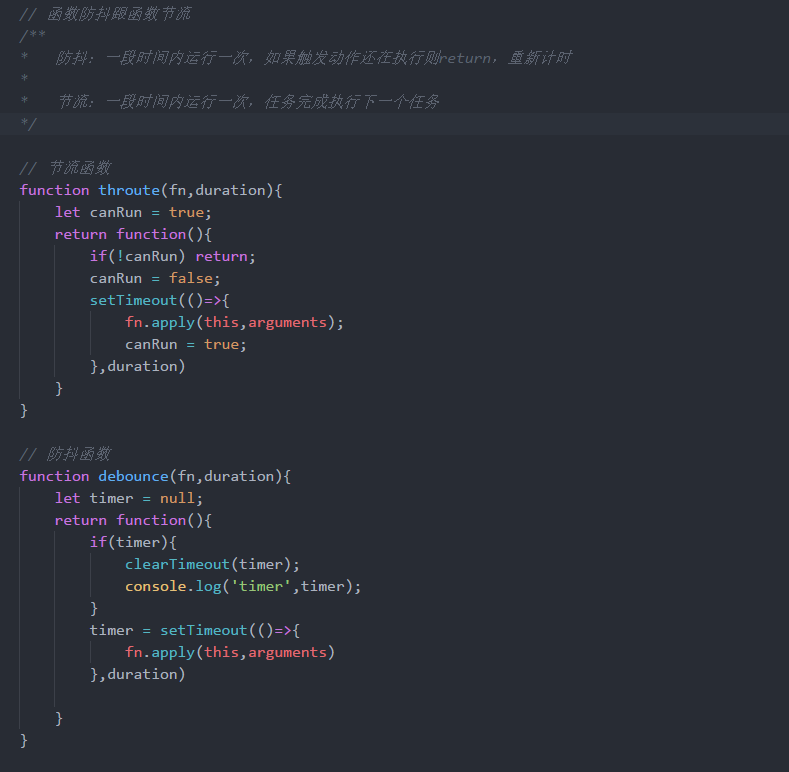

# 概念

函数节流和函数防抖，两者都是优化高频率执行 js 代码的一种手段。

大家大概都知道旧款电视机的工作原理，就是一行行得扫描出色彩到屏幕上，然后组成一张张图片。由于肉眼只能分辨出一定频率的变化，当高频率的扫描，人类是感觉不出来的。反而形成一种视觉效果，就是一张图。就像高速旋转的风扇，你看不到扇叶，只看到了一个圆一样。

同理，可以类推到 js 代码。在一定时间内，代码执行的次数不一定要非常多。达到一定频率就足够了。因为跑得越多，带来的效果也是一样。倒不如，把 js 代码的执行次数控制在合理的范围。既能节省浏览器 CPU 资源，又能让页面浏览更加顺畅，不会因为 js 的执行而发生卡顿。这就是函数节流和函数防抖要做的事。

函数节流是指一定时间内 js 方法只跑一次。比如人的眨眼睛，就是一定时间内眨一次。这是函数节流最形象的解释。

函数防抖是指频繁触发的情况下，只有足够的空闲时间，才执行代码一次。比如生活中的坐公交，就是一定时间内，如果有人陆续刷卡上车，司机就不会开车。只有别人没刷卡了，司机才开车。

# 函数节流

函数节流应用的实际场景，多数在监听页面元素滚动事件的时候会用到。因为滚动事件，是一个高频触发的事件。以下是监听页面元素滚动的示例代码：

```
// 函数节流
var canRun = true
document.getElemntById('throttle').onscroll = function(){
  if(!canRun){
    // 判断是否已空闲，如果在执行中，则直接return
    return
  }
  canRun = false
  setTimeout(function(){
    console.log('函数节流')
    canRun = true
  }, 300)
}
```

函数节流的要点是，声明一个变量当标志位，记录当前代码是否在执行。
如果空闲，则可以正常触发方法执行。
  如果代码正在执行，则取消这次方法执行，直接 return。

这个方法的作用是监听 ID 为 throttle 元素的滚动事件。
  当 canRun 为 true，则代表现在的滚动处理事件是空闲的，可以使用。
  通过关卡 if(!canRun)，等于就拿到了通行证。然后下一步的操作就是立马将关卡关上 canRun=false。这样，其他请求执行滚动事件的方法，就被挡回去了。
  接着用 setTimeout 规定最小的时间间隔 300，接着再执行 setTimeout 方法体里面的内容。
  最后，等 setTimeout 里面的方法都执行完毕，才释放关卡 canRun=true，允许下一个访问者进来。

这个函数节流的实现形式，需要注意的是执行的间隔时间是>=300ms。如果具体执行的方法是包含 callback 的，也可以将 canRun=true 这一步放到 callback 中。理解了函数节流的关卡设置重点，其实改起来就简单多了。

# 函数防抖

函数防抖的应用场景，最常见的就是用户注册时候的手机号码验证和邮箱验证了。只有等用户输入完毕后，前端才需要检查格式是否正确，如果不正确，再弹出提示语。以下还是以页面元素滚动监听的例子，来进行解析：

```
// 函数防抖
var timer = false;
document.getElementById("debounce").onscroll = function(){
    clearTimeout(timer); // 清除未执行的代码，重置回初始化状态

    timer = setTimeout(function(){
        console.log("函数防抖");
    }, 300);
};  
```

函数防抖的要点，也是需要一个 setTimeout 来辅助实现。延迟执行需要跑的代码。
  如果方法多次触发，则把上次记录的延迟执行代码用 clearTimeout 清掉，重新开始。
  如果计时完毕，没有方法进来访问触发，则执行代码。

这个方法的作用是监听 ID 为 debounce 元素的滚动事件
  进入滚动事件方法体的时候，做的第一件事就是清除上次未执行的 setTimeout。而 setTimeout 的引用 id 由变量 timer 记录。
 clearTimeout 方法，允许传入无效的值。所以这里直接执行 clearTimeout 即可。
  然后，将需要执行的代码放入 setTimeout 中，再返回 setTimeout 引用给 timer 缓存。
  如果倒计时 300ms 以后，还没有新的方法触发滚动事件，则执行 setTimeout 中的代码。

函数防抖的实现重点，就是巧用 setTimeout 做缓存池，而且可以轻易地清除待执行的代码。
  其实，用队列的方式也可以做到这种效果。这里就不深入了。

https://wall-wxk.github.io/blogDemo/2017/02/15/throttleAndDebounce.html

说个好理解的吧：
节流：类似于坐地铁过安检门，一次一人，每个人进入后 3 秒后 门关闭，等待下一个人进入，，
防抖：类似于坐公交，司机需等待最后一个人进入关门，每次进一个人，司机就要多等待几秒 再关门。

两者都是为了防止频繁的触发同一事件造成性能问题，都利用了计时器，闭包，事件委托，但是实现的思路有所不同。
事件防抖：规定了一个时间，每次在这个时间段内又触发了同一事件，销毁原来计时器，用新计时器重新计时。
事件节流：也是规定一个时间段，和一个是否空闲状态的标志位，触发事件后状态变为非空闲，这段时间触发事件时都作废，直到事件执行完状态再变为空闲，进入到下一次。
主要用在：滚动窗体，改变窗体大小，拖动元素，修改文本框内容等触发事件频繁的地方


