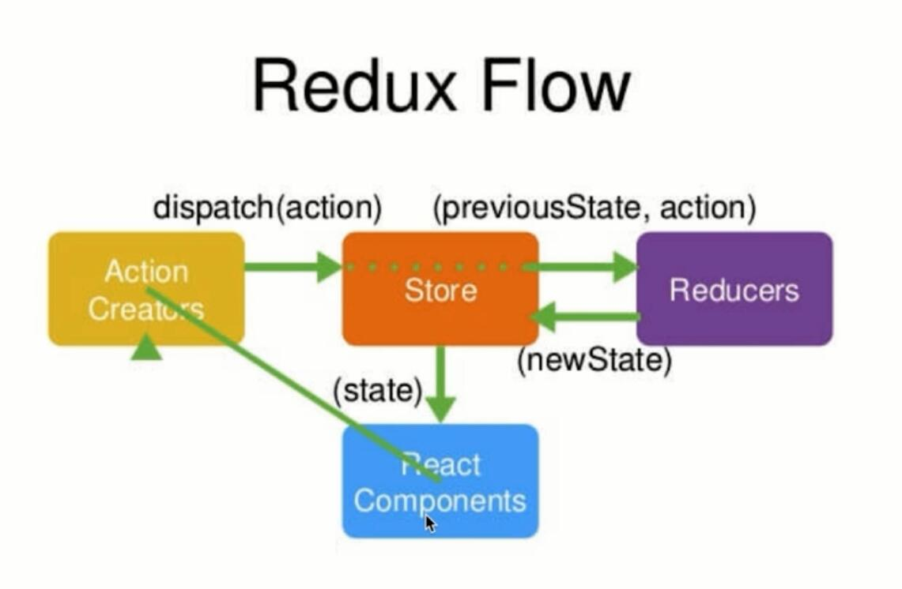
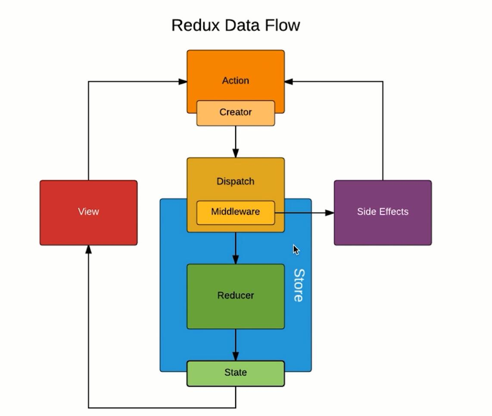

##react TodoList

1. state数据
2. jsx模板
3. 生成虚拟dom
4. 生成真是dom
5. state变化
6. 虚拟dom对比diff，找到原始虚拟dom与心得虚拟dom的区别，极大提升性能(diff算法)同层比对


jsx -> js对象 -> 真是的DOM


## 生命周期函数

1. componentWillMount
2. render
3. componentDidMount
4. componentWillReceiveProps
5. shouldComponentUpdate
6. componentWillUpdate
7. render
8. componentDidUpdate





## 其他

- actionCreator和actionTypes是为解决action名字写错，不报错的问题，第二方便管理

```
// index.js

import React from 'react';
import ReactDOM from 'react-dom';
import TodoList from './TodoList';
import { Provider } from 'react-redux'
import store from './store'

// Provider是特殊的组件，方便store传值方式
const App = (
  <Provider store={store}>
    <TodoList />
  </Provider>
)

ReactDOM.render(App, document.getElementById('root'));
```

```
// TodoList.js

const mapSateToProps = (state) => {
  return {
    inputValue: state.inputValue,
    list: state.list
  }
}

const mapDispatch = (dispatch) => {
  return {
    changeInputValue(e) {
      const action = ChangeInputVlue(e.target.value)
      dispatch(action)
    },
    handleClick() {
      const action = AddItem()
      dispatch(action)
    },
    handleDelete(index){
      const action = HandleDelete(index)
      dispatch(action)
    }
  }
}
export default connect(mapSateToProps, mapDispatch)(TodoList)
```
